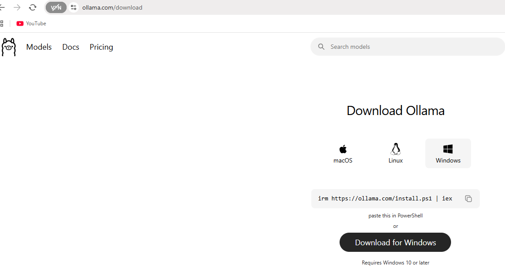
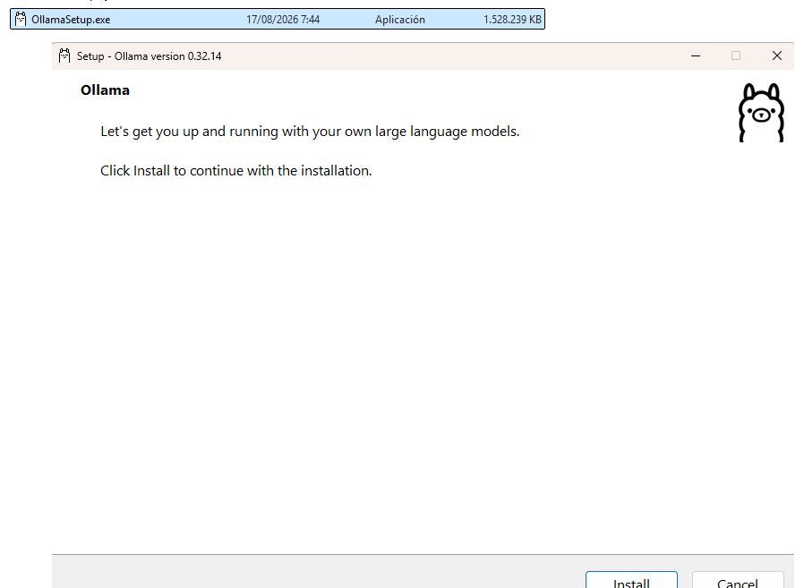
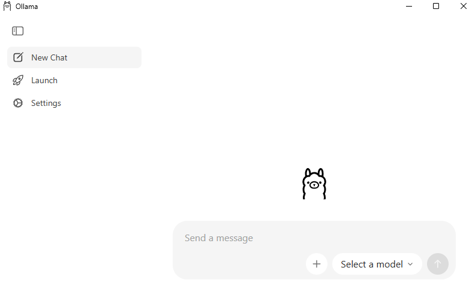
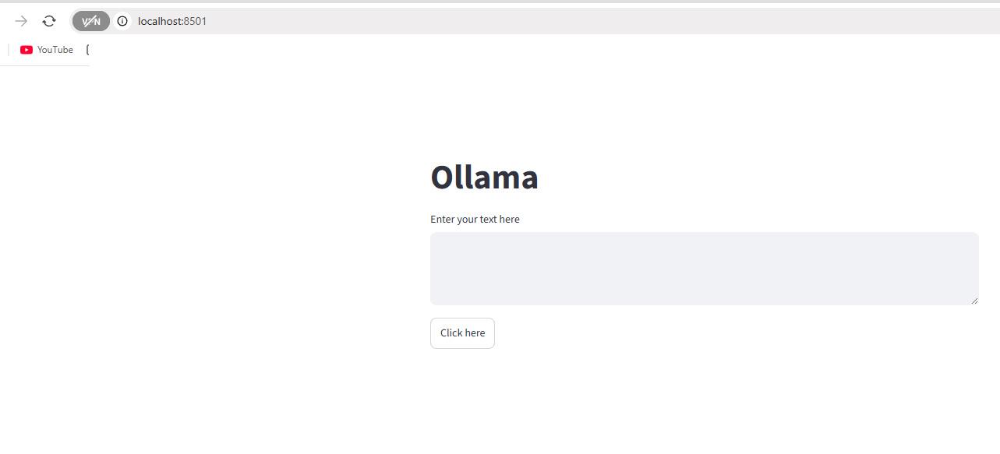
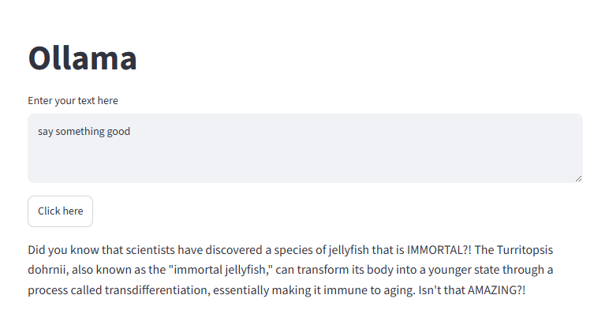
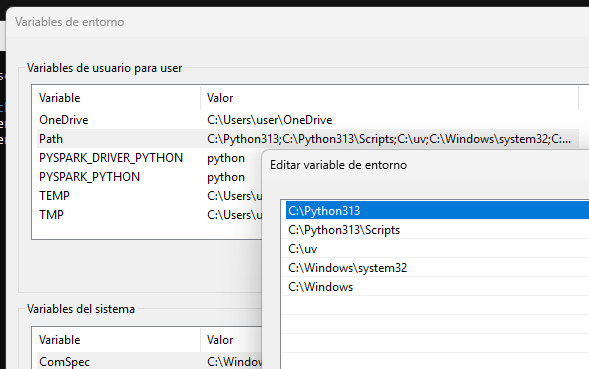
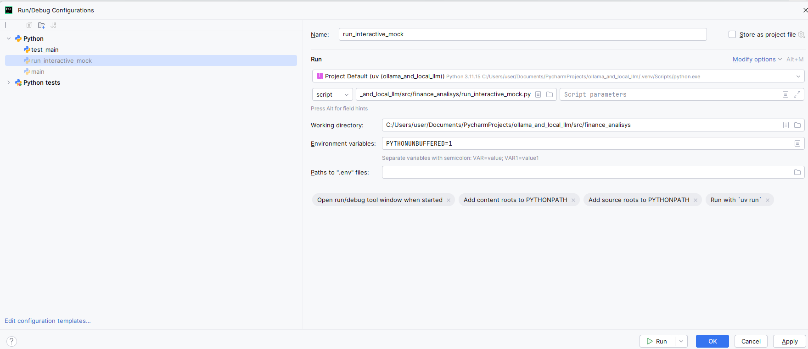
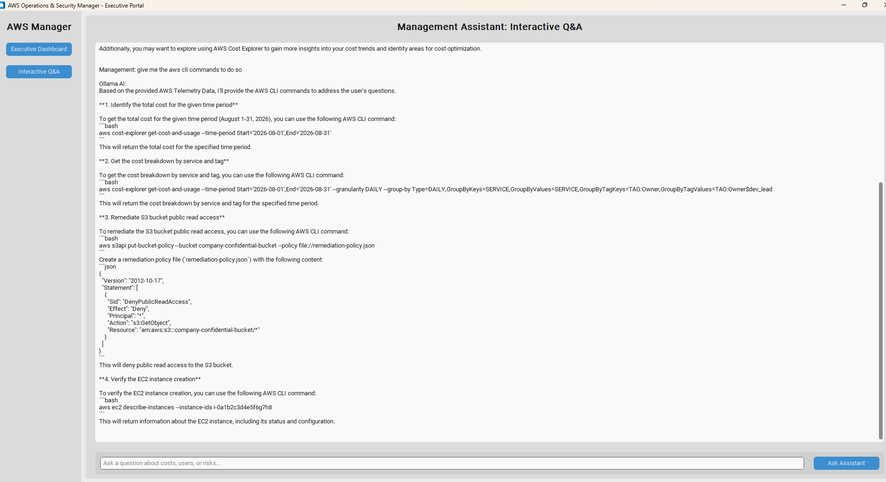
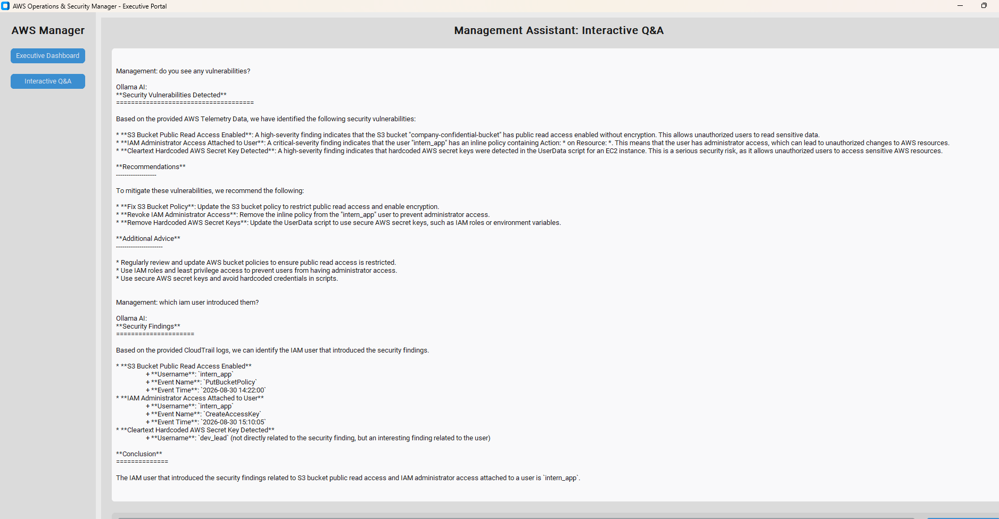

# 006 LLM model and Streamlit

https://www.udemy.com/course/mastering-local-llms-with-ollama-and-python-doing-projects/learn/lecture/45142355#overview

## Setup the environment

* Download Ollama from https://ollama.com/download



* Install Ollama



* Start the Ollama server

Either running the `Ollama` gui ...



... or from command line as well:

```shell
(ollama_and_local_llm) PS C:\Users\user\Documents\PycharmProjects\ollama_and_local_llm> ollama serve
time=2026-09-01T14:22:46.896+02:00 level=INFO source=routes.go:1933 msg="server config" env="map[CUDA_VISIBLE_DEVICES: GGML_VK_VISIBLE_DEVICES: GPU_DEVICE_ORDINAL: HIP_VISIBLE_DEVICES: HSA_OVERRIDE_GFX_VERSION: HTTPS_PROXY: HTTP_PROXY: LLAMA_ARG_FIT: LLAMA_ARG_FIT_TARGET: NO_PROXY: OLLAMA_CONTEXT_LENGTH:0 OLLAMA_DEBUG:INFO OLLAMA_DEBUG_LOG_REQUESTS:false OLLAMA_EDITOR: OLLAMA_FLASH_ATTENTION:false OLLAMA_GO_TEMPLATE:true OLLAMA_GPU_OVERHEAD:0 OLLAMA_HOST:http://127.0.0.1:11434 OLLAMA_IGPU_ENABLE: OLLAMA_KEEP_ALIVE:5m0s OLLAMA_KV_CACHE_TYPE: OLLAMA_LLM_LIBRARY: OLLAMA_LOAD_TIMEOUT:5m0s OLLAMA_MAX_LOADED_MODELS:0 OLLAMA_MAX_QUEUE:512 OLLAMA_MAX_TRANSFER_STREAMS:4 OLLAMA_MODELS:C:\\Users\\user\\.ollama\\models OLLAMA_NOHISTORY:false OLLAMA_NOPRUNE:false OLLAMA_NO_CLOUD:false OLLAMA_NUM_PARALLEL:1 OLLAMA_ORIGINS:[http://localhost https://localhost http://localhost:* https://localhost:* http://127.0.0.1 https://127.0.0.1 http://127.0.0.1:* https://127.0.0.1:* http://0.0.0.0 https://0.0.0.0 http://0.0.0.0:* https://0.0.0.0:* app://* file://* tauri://* vscode-webview://* vscode-file://*] OLLAMA_REMOTES:[ollama.com] OLLAMA_SCHED_SPREAD:false OLLAMA_VULKAN:true ROCR_VISIBLE_DEVICES:]"
time=2026-09-01T14:22:46.915+02:00 level=INFO source=routes.go:1935 msg="Ollama cloud disabled: false"
time=2026-09-01T14:22:46.917+02:00 level=INFO source=images.go:912 msg="total blobs: 5"
time=2026-09-01T14:22:46.917+02:00 level=INFO source=images.go:919 msg="total unused blobs removed: 0"
time=2026-09-01T14:22:46.918+02:00 level=INFO source=routes.go:1990 msg="Listening on 127.0.0.1:11434 (version 0.32.14)"
time=2026-09-01T14:22:46.919+02:00 level=INFO source=model_list_cache.go:112 msg="model list cache hydration complete" models=1 failures=0 elapsed=575.9µs
time=2026-09-01T14:22:46.919+02:00 level=INFO source=runner.go:60 msg="discovering available GPUs..."
time=2026-09-01T14:22:47.147+02:00 level=INFO source=model_recommendations.go:177 msg="model recommendations cache sleep scheduled" wait=3h15m49.066041163s consecutive_failures=0
time=2026-09-01T14:22:48.802+02:00 level=INFO source=runner.go:405 msg="dropping integrated GPU; to enable, set OLLAMA_IGPU_ENABLE=1" id=1 library=Vulkan compute=0.0 name=Vulkan1 description="Intel(R) Iris(R) Xe Graphics" pci_id=""
time=2026-09-01T14:22:48.802+02:00 level=INFO source=types.go:32 msg="inference compute" id=0 filter_id=0 library=Vulkan compute=0.0 name=Vulkan0 description="NVIDIA GeForce RTX 3080 Laptop GPU" libdirs=ollama,vulkan driver=0.0 pci_id=0000:01:00.0 type=discrete total="7.9 GiB" available="7.1 GiB"
time=2026-09-01T14:22:48.802+02:00 level=INFO source=routes.go:2040 msg="vram-based default context" total_vram="7.9 GiB" default_num_ctx=4096

```

* Pull the `llama3.1` model:

```shell
(ollama_and_local_llm) PS C:\Users\user\Documents\PycharmProjects\ollama_and_local_llm> ollama pull llama3.1
pulling manifest 
pulling 667b0c1932bc: 100% ▕██████████████████████████████████████████████████████████████████████████████████████████████████████████████████████████████████████████████████████████████████████▏ 4.9 GB                         
pulling 948af2743fc7: 100% ▕██████████████████████████████████████████████████████████████████████████████████████████████████████████████████████████████████████████████████████████████████████▏ 1.5 KB                         
pulling 0ba8f0e314b4: 100% ▕██████████████████████████████████████████████████████████████████████████████████████████████████████████████████████████████████████████████████████████████████████▏  12 KB                         
pulling 56bb8bd477a5: 100% ▕██████████████████████████████████████████████████████████████████████████████████████████████████████████████████████████████████████████████████████████████████████▏   96 B                         
pulling 455f34728c9b: 100% ▕██████████████████████████████████████████████████████████████████████████████████████████████████████████████████████████████████████████████████████████████████████▏  487 B                         
verifying sha256 digest 
writing manifest 
success 
```


* Add the `streamlit` package to the project:

```shell
(ollama_and_local_llm) PS C:\Users\user\Documents\PycharmProjects\ollama_and_local_llm> uv add streamlit
Resolved 49 packages in 1ms
Checked 48 packages in 3ms
```

* Run the Streamlit server:

```shell
(ollama_and_local_llm) PS C:\Users\user\Documents\PycharmProjects\ollama_and_local_llm> streamlit.exe run .\src\ollama_and_local_llm\006_llm_model_and_streamlit.py
2026-09-01 14:29:09.297 Uvicorn server started on :::8501

  You can now view your Streamlit app in your browser.

  Local URL: http://localhost:8501
  Network URL: http://192.168.0.13:8501

  Help agents write better Streamlit apps?
  Install the official Streamlit skills by running streamlit skills in your terminal.

```

A web page is spinned up:




You can interact with the local `llama3.1` llm model:




## Interact with Ollama from command line

* List the models:

```shell
C:\Users\user>ollama list
NAME               ID              SIZE      MODIFIED
llama3.1:latest    46e0c10c039e    4.9 GB    11 minutes ago
```


# Finance analysis

Here is an example using CustomTkinter, Boto3, and Ollama.

In this implementation, Ollama acts as an executive cloud financial and security analyst, parsing AWS cost and security metrics to generate C-level insights, KPI cards, and exportable CSV reports.

## Pre-requisites

* Python and [uv](https://docs.astral.sh/uv/):



```shell
user@DESKTOP-SCNMK3I MINGW64 ~/Documents/PycharmProjects/prueba_sgd_group
Thu Aug 27 09:50:55
$ python --version
Python 3.14.6

user@DESKTOP-SCNMK3I MINGW64 ~/Documents/PycharmProjects/prueba_sgd_group
Thu Aug 27 10:33:58
$ uv --version
uv 0.12.0 (b88d7c5c4 2026-07-28 x86_64-pc-windows-msvc)
```
* Adding the required packages to the project:

```shell
(ollama_and_local_llm) PS C:\Users\user\Documents\PycharmProjects\ollama_and_local_llm> uv add pytest pytest-mock moto boto3 customtkinter ollama
Resolved 68 packages in 309ms
      Built ollama-and-local-llm @ file:///C:/Users/user/Documents/PycharmProjects/ollama_and_local_llm                                                                                                                             
Prepared 3 packages in 384ms
Uninstalled 1 package in 2ms
Installed 14 packages in 662ms
 + cffi==2.1.1
 + cryptography==50.0.1
 + iniconfig==2.3.0
 + moto==5.2.3
 ~ ollama-and-local-llm==0.1.0 (from file:///C:/Users/user/Documents/PycharmProjects/ollama_and_local_llm)
 + pluggy==1.6.0
 + pycparser==3.0
 + pygments==2.21.0
 + pytest==9.1.1
 + pytest-mock==3.15.1
 + pyyaml==6.0.3
 + responses==0.26.3
 + werkzeug==3.1.8
 + xmltodict==1.0.4
```


* Running the `run_interactive_mock.py`







Sequence that you can use to test the same from your laptop:


    Welcome! Ask any live question regarding costs, users, or infrastructure.
    
    
    Management: who did the biggest expense in latest month?
    
    Ollama AI:
    Based on the provided AWS Telemetry Data, the biggest expense in the latest month (August 2026) is attributed to the 'Amazon EC2' resource, specifically for the 'dev_lead' owner.
    
    The total unblended cost for the month of August is $239.60, with $142.50 of that cost being attributed to the 'Amazon EC2' resource for the 'dev_lead' owner.
    
    
    Management: which services did he run to do so big cost?
    
    Ollama AI:
    Based on the provided AWS Telemetry Data, I can help you identify the services that contributed to the high cost.
    
    According to the Cost Data, the top services that incurred costs are:
    
    1. **Amazon EC2**: With a cost of $142.50, this is the largest contributor to the total cost.
       2. **Amazon RDS**: With a cost of $85.00, this is the second-largest contributor to the total cost.
       3. **Amazon S3**: With a cost of $12.10, this is the third-largest contributor to the total cost.
    
    These costs are broken down by the `Keys` attribute in the `Groups` section of the Cost Data. The `Keys` attribute indicates the specific service (e.g., `Amazon EC2`) and any associated tags (e.g., `Tag:Owner$dev_lead`).
    
    To further optimize costs, I recommend reviewing the usage of these services and considering the following standard AWS operational advice:
    
    * Review EC2 instance types and consider downsizing or optimizing instance types to reduce costs.
      * Review RDS instance types and consider downsizing or optimizing instance types to reduce costs.
      * Review S3 bucket permissions and ensure that public read access is disabled to reduce potential security risks.
    
    Additionally, you may want to explore using AWS Cost Explorer to gain more insights into your cost trends and identify areas for cost optimization.
    
    
    Management: give me the aws cli commands to do so
    
    Ollama AI:
    Based on the provided AWS Telemetry Data, I'll provide the AWS CLI commands to address the user's questions.
    
    **1. Identify the total cost for the given time period**
    
    To get the total cost for the given time period (August 1-31, 2026), you can use the following AWS CLI command:
    ```bash
    aws cost-explorer get-cost-and-usage --time-period Start='2026-08-01',End='2026-08-31'
    ```
    This will return the total cost for the specified time period.
    
    **2. Get the cost breakdown by service and tag**
    
    To get the cost breakdown by service and tag, you can use the following AWS CLI command:
    ```bash
    aws cost-explorer get-cost-and-usage --time-period Start='2026-08-01',End='2026-08-31' --granularity DAILY --group-by Type=DAILY,GroupByKeys=SERVICE,GroupByValues=SERVICE,GroupByTagKeys=TAG:Owner,GroupByTagValues=TAG:Owner$dev_lead
    ```
    This will return the cost breakdown by service and tag for the specified time period.
    
    **3. Remediate S3 bucket public read access**
    
    To remediate the S3 bucket public read access, you can use the following AWS CLI command:
    ```bash
    aws s3api put-bucket-policy --bucket company-confidential-bucket --policy file://remediation-policy.json
    ```
    Create a remediation policy file (`remediation-policy.json`) with the following content:
    ```json
    {
      "Version": "2012-10-17",
      "Statement": [
        {
          "Sid": "DenyPublicReadAccess",
          "Effect": "Deny",
          "Principal": "*",
          "Action": "s3:GetObject",
          "Resource": "arn:aws:s3:::company-confidential-bucket/*"
        }
      ]
    }
    ```
    This will deny public read access to the S3 bucket.
    
    **4. Verify the EC2 instance creation**
    
    To verify the EC2 instance creation, you can use the following AWS CLI command:
    ```bash
    aws ec2 describe-instances --instance-ids i-0a1b2c3d4e5f6g7h8
    ```
    This will return information about the EC2 instance, including its status and configuration.
    
    
    Welcome! Ask any live question regarding costs, users, or infrastructure.
    
    
    Management: who did the biggest expense in latest month?
    
    Ollama AI:
    Based on the provided AWS Telemetry Data, the biggest expense in the latest month (August 2026) is attributed to the 'Amazon EC2' resource, specifically for the 'dev_lead' owner.
    
    The total unblended cost for the month of August is $239.60, with $142.50 of that cost being attributed to the 'Amazon EC2' resource for the 'dev_lead' owner.
    
    
    Management: which services did he run to do so big cost?
    
    Ollama AI:
    Based on the provided AWS Telemetry Data, I can help you identify the services that contributed to the high cost.
    
    According to the Cost Data, the top services that incurred costs are:
    
    1. **Amazon EC2**: With a cost of $142.50, this is the largest contributor to the total cost.
       2. **Amazon RDS**: With a cost of $85.00, this is the second-largest contributor to the total cost.
       3. **Amazon S3**: With a cost of $12.10, this is the third-largest contributor to the total cost.
    
    These costs are broken down by the `Keys` attribute in the `Groups` section of the Cost Data. The `Keys` attribute indicates the specific service (e.g., `Amazon EC2`) and any associated tags (e.g., `Tag:Owner$dev_lead`).
    
    To further optimize costs, I recommend reviewing the usage of these services and considering the following standard AWS operational advice:
    
    * Review EC2 instance types and consider downsizing or optimizing instance types to reduce costs.
      * Review RDS instance types and consider downsizing or optimizing instance types to reduce costs.
      * Review S3 bucket permissions and ensure that public read access is disabled to reduce potential security risks.
    
    Additionally, you may want to explore using AWS Cost Explorer to gain more insights into your cost trends and identify areas for cost optimization.
    
    
    Management: give me the aws cli commands to do so
    
    Ollama AI:
    Based on the provided AWS Telemetry Data, I'll provide the AWS CLI commands to address the user's questions.
    
    **1. Identify the total cost for the given time period**
    
    To get the total cost for the given time period (August 1-31, 2026), you can use the following AWS CLI command:
    ```bash
    aws cost-explorer get-cost-and-usage --time-period Start='2026-08-01',End='2026-08-31'
    ```
    This will return the total cost for the specified time period.
    
    **2. Get the cost breakdown by service and tag**
    
    To get the cost breakdown by service and tag, you can use the following AWS CLI command:
    ```bash
    aws cost-explorer get-cost-and-usage --time-period Start='2026-08-01',End='2026-08-31' --granularity DAILY --group-by Type=DAILY,GroupByKeys=SERVICE,GroupByValues=SERVICE,GroupByTagKeys=TAG:Owner,GroupByTagValues=TAG:Owner$dev_lead
    ```
    This will return the cost breakdown by service and tag for the specified time period.
    
    **3. Remediate S3 bucket public read access**
    
    To remediate the S3 bucket public read access, you can use the following AWS CLI command:
    ```bash
    aws s3api put-bucket-policy --bucket company-confidential-bucket --policy file://remediation-policy.json
    ```
    Create a remediation policy file (`remediation-policy.json`) with the following content:
    ```json
    {
      "Version": "2012-10-17",
      "Statement": [
        {
          "Sid": "DenyPublicReadAccess",
          "Effect": "Deny",
          "Principal": "*",
          "Action": "s3:GetObject",
          "Resource": "arn:aws:s3:::company-confidential-bucket/*"
        }
      ]
    }
    ```
    This will deny public read access to the S3 bucket.
    
    **4. Verify the EC2 instance creation**
    
    To verify the EC2 instance creation, you can use the following AWS CLI command:
    ```bash
    aws ec2 describe-instances --instance-ids i-0a1b2c3d4e5f6g7h8
    ```
    This will return information about the EC2 instance, including its status and configuration.
    

* Asking for security findings


